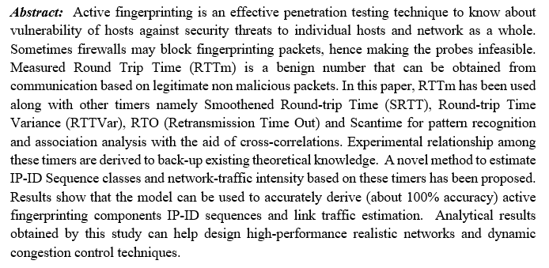

# A Study of active fingerprinting of Hosts in an Institutional Network

Published web-page is available <a href="https://newtein.github.io/RTT_Analysis/" target="_blank"> here.</a>

### (Research project) 
#### Abstract: 

Work is accepted for publication in Journal of Wireless Personal Communication by Springer (Scopus, SCI indexed).
